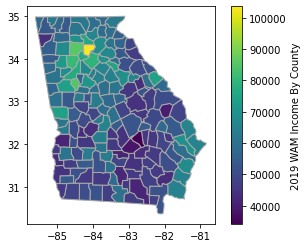
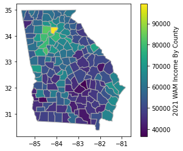
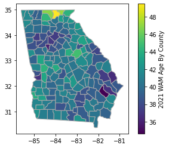
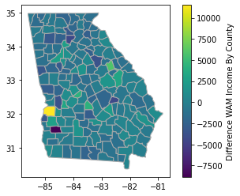
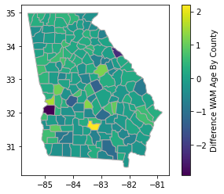
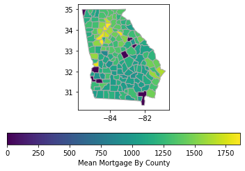
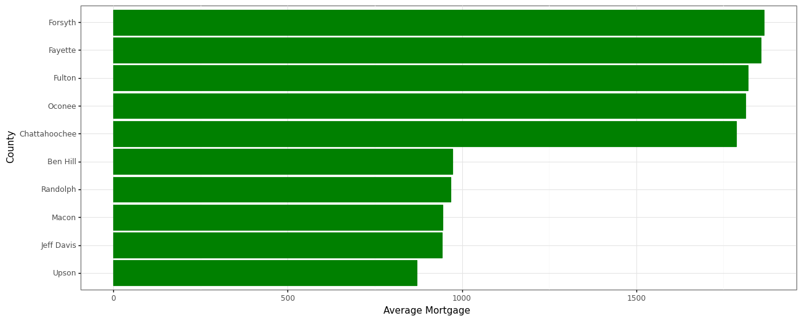
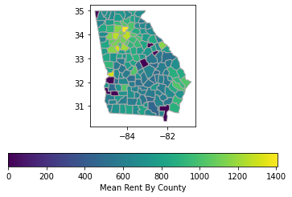
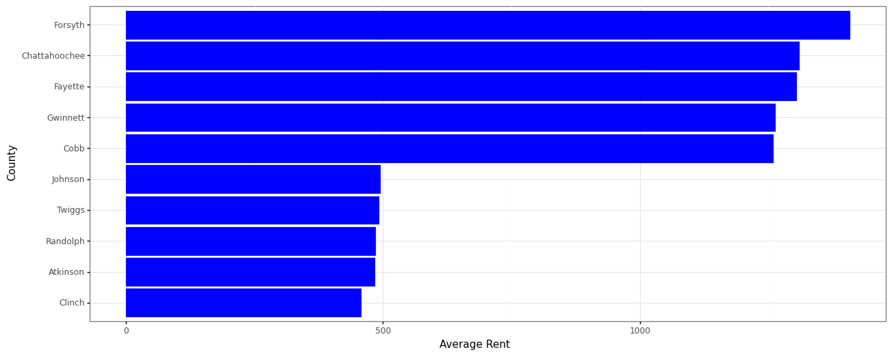
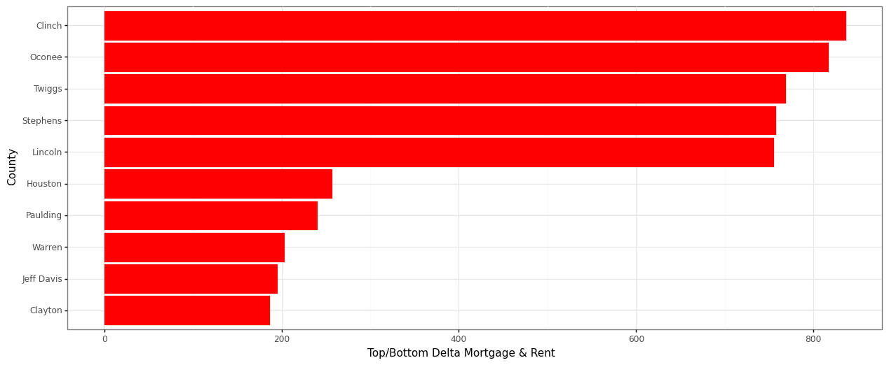

# End of Semester Checklist

## Group Projects

### Project 1

#### Slack, VScode, Rstudio, Git, and Github

- [x] Make sure you are in our Slack workspace.
- [x] Finish setting up VScode for programming in R and Python.
- [x] Finish setting up Rstudio.
- [x] Finish installing Git.
- [x] Finish creating your Github account and connecting to our organization.

#### R

- [x] Recreate the two graphics in this repo using `gapminder` dataset from `library(gapminder)` (get them to match as closely as you can).
    - [x] Use `library(tidyverse)` to load ggplot2 and dplyr and the `theme_bw()` to duplicate the first plot.
    - [x] Use `scale_y_continuous(trans = "sqrt")` to get the correct scale on the y-axis.
    - [x] Build weighted average data set using `weighted.mean()` and GDP with `summarise()` and `group_by()` that will be the black continent average line on the second plot.
    - [x] Use `theme_bw()` to duplicate the second plot. You will need to use the new data to make the black lines and dots showing the continent average.
    - [x] Use `ggsave()` and save each plot as a .png with a width of 15 inches.

#### Python

- [x] Recreate the two graphics in this repo using the `gapminder` dataset from `library(gapminder)` (get them to match as closely as you can).
    - [x] Export the data from R and import it into your Python environment. 
    - [x] Use [plotnine](https://plotnine.readthedocs.io/en/stable/) or [Altair](https://altair-viz.github.io/index.html) to mimic the two graphics as close as possible.
    - [x] Build a weighted average data set using GDP, the black continent average line on the second plot.

### Project 2

- [x] Deliverable 1: Read Python & R
    - [x] Read Chapter 5 Python
    - [x] Read Chapter 7 Python
    - [x] Read Chapter 5 R
    - [x] Read Chapter 7 R
- [x] Deliverable 2:  Decipher R parser script to Python
- [x] Deliverable 3:  Ensure Python parser gives same results as 2016 data from article
- [x] Deliverable 4:  Download 2019 data from CDC (Should have same data in article plus 2017 - 2019 data)
- [x] Deliverable 5:  Add seasons to data (months & season variables)
- [x] Deliverable 6:  Provide a brief summary of the [FiveThirtyEight article](https://fivethirtyeight.com/features/gun-deaths/).
    - [ ] Create one plot that provides similar insight to their visualization in the article. It does not have to look like theirs. (Cancelled)
    - [x] Write a short paragraph summarizing their article.
- [x] Deliverable 7:  Address the client's need for emphasis areas of their commercials for different seasons of the year.
    - [x] Provide plots that help them know the different potential variables they could address in different seasons (2-4 visualizations)
    - [x] Write a short paragraph describing each image.

### Project 3

1. Complete the data joing and munging in R and Python.
2. Complete the visualizations in R and Python.

- [X] Create an account with [SafeGraph](https://www.safegraph.com/academics)
- [X] Create a data investigation narrative or question that will drive your project.
- [X] Tell a story through time-series charts for your narrative.
- [X] Tell a story through spatial maps for your narrative.
- [X] Include a visualization that displays space and time in your narrative.

### Project 4

## Individual Projects

###  'Project 1: Who Is THE James Bond'

There have been 25 James Bond movies over the last 58 years (excluding releases in 2021) generating over $17B in inflation adjusted profit.  Over these 25 movies there have been six actors portraying James Bond, and the question that often comes up "Who Is James Bond". This analysis is being done for the movie loving fans to help answer that question.

Let us start by looking at Graph 1 which shows the inflation adjusted worldwide box-office take by year. One can see all the movies appear lucrative as the majority exceed $400M in worldwide box-office totals. Additionally, the budget line appears to have no correlation to the box-office totals. Perhaps it is better to review the inflation adjusted profit.  

Before diving into the profits let us review a couple of non-financial based graphs. Graph 2 is a quick view on counts of movies by actor. This of course could have drastic impacts on the total profit as we would not expect an actor with one movie to exceed one who has done seven movies.  It is clear Connery and Moore have an edge portraying James Bond in seven movies each.  The current James Bond, Daniel Craig, has made four James Bond movies through 2020.  

Moving on to Graph 3 which covers the IMDB user ratings of various movies.  For the James Bond movies they rate Connery and Craig over 7.0 on average out of 10.  Similar to the count of movies Roger Moore is right behind with 6.75 average rating of his James Bond roles.  

The first of the detailed financials, Graph 4 shows the non-adjusted worldwide box-office take.  Daniel Craig easily leads with over $3B, in fact he almost takes in more than the other 21 movies combined.  Since these movies span over 58 years this is not quite comparing apples to apples.

In Graph 5 one can see the inflation adjusted profit by actor.  Connery far exceeds his counterparts with $5B of inflation adjusted profits followed by Moore at approximately $4B.  Lastly, Daniel Craig's box-office profits are approximately $2.75B.  It appears Connery is truly the king, but we must remember he did have seven movies versus Craig's four.

The final graph, Graph 6, shows the average inflation adjusted movie profit by actor.  In this we have the same reoccurring actors lead the pack:  Connery averages $721M per movie, Craig $681M, and Moore at $581M.  

At the end of 2020 the actor who is the best James Bond seems clear, Sean Connery.  He leads with an average inflation adjusted profit of $721M per movie, first in total inflation adjusted profit of $5B, and the raters at IMDB have his movies ranked second at 7.0 of 10.  

It should be noted Craig has a fifth James Bond movie appearing in 2021 and he could still take the role of James Bond more in the future.  

###  'Project 2:  Hackathon, Gas Stations Pre/Post Covid'

As a team we wanted to look at the profile of gas station customers in Georgia pre and post covid (assumption July 2019 & July 2021 are pre and post covid months).  The hypothesis is that remote work popularity would impact what type of customers are buying gas now versus those purchasing gas before covid struck the state of Georgia.

#### My Contributions

For this project I was responsible for creating the code and datasets used to create subsequent graphs.  The hackathon.r graph contains the coding for the project.  

#### My Story

The first two graphs are the weighted average income for 2019 and 2021 by county for Georgia gas station customers. The static graph is difficult to see if there are changes over the two years. Viewing an interactive map will help look at some of the details.

   

[2019 Interactive Map](documents/ga_p3_income19.html)
[2021 Interactive Map](documents/ga_p3_income21.html)

The next two graphs are the weighted average age for 2019 and 2021 by county for Georgia gas station customers. Like the income graph this graph is difficult to see if there are changes over the two years. Viewing the previous interactive map will help look at some of the details.

   

The final two graphs show the diffence in weighted average income and age between 2019 and 2021 gas station customers.  Around metro Atlanta we see drops in most suburban counties.  The one oddity is one county, Stewart, in western Georgia that saw an increase in weighted average of income in excess of $11k.  

   

[2021 - 2019 Difference Interactive Map](documents/ga_p3_diff_income.html)

###  Project 3: Rent vs Own in Georgia

There has been an ongoing debate whether one should buy or rent their homes.  Data from [Kaggle's](https://www.kaggle.com/goldenoakresearch/us-acs-mortgage-equity-loans-rent-statistics?select=real_estate_db.csv) website on census mortgage, rent, and debt statistics was downloaded for the US to compare mortgages and rents in the state of Georgia. Both the mortgages and rents include all ancillary home costs, such as utilities, taxes, insurances, etc...

## Mortgages

In the first glance most of the high mortgage areas center around metro Atlanta, and further up I-85 as seen in the first graph below. Additionally, as one gets further into Atlanta suburbs one can see mortgage sprawl is following with the working populations. Communities well outside the metro area still have monthly mortgage expenses over $1,000.  

The next graph is looking at the top and bottom five average mortgages in Georgia. The top five average mortgages by county in Georgia all exceed $1750 while the bottom five all fall under $1000.

## Rents

In the first glance most of the high rents areas center around metro Atlanta. This is expected as mountains exist to the north with a smaller population, and farmlands to the south and east of Fulton County. 

The next graph is looking at the top and bottom five average rents in Georgia. The top five average rents by county in Georgia all exceed $1250 while the bottom five all fall under $500.

## Deltas

The next graph is looking at the top and bottom five deltas between average mortgages and rents by county in Georgia. The top five deltas by county in Georgia all exceed $750 while the bottom five all fall under $250.

Given that the delta between rents and mortgages are all above $250 it seems a given that renting is the best financial option.  Additional research will be needed to ascertain if variables other than location are impacting these deltas.  For example what are the sizes of the homes?  Are renters taking smaller homes whereas home owners with mortgages are in larger estates?  In some counties section 8 housing is no legal, such as Cobb County, which will impact the deltas between mortgages and rents.

## Interactive Maps

Provided below are interactive maps for mortgage and rents in the state of Georgia.

[Mortgages](documents/ga_p3_mean_mort.html)

[Rents](documents/ga_p3_mean_rent.html)

